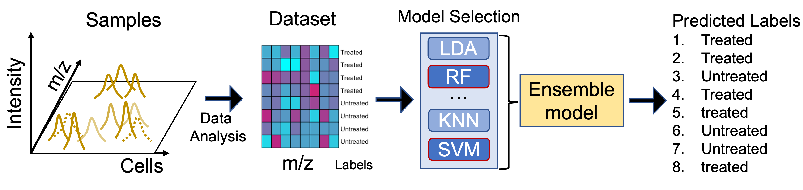

# Ensemble Learning for Cell Phenotype classification
Recent studies have applied single cell mass spectrometry coupled with machine learning classification method to predict the phenotype of individual drug resistant cells. However, these works have focused on the use of random forest and artificial neural network models. To improve these models and achieve accurate prediction, this paper presents an ensemble learning model that combines high-accuracy models such as random forest and support vector machine in order to attain a 10 percent accuracy improvement. This ensemble model has the potential to improve the performance of machine learning models developed for single-cell phenotype prediction by its availability as an easy-to-use R package.

The data were collected from single cell mass spectrometry. The training set of mass-spec intensity is provided from analyzed raw mass-spec data. The training set were with binary labels indicating whether the cell was treated by anti-drug compound. The series of machine learning models were used to produces the prediction of the labels (such as ’treated’ or ’untreated’). The models with high accuracy were used for following hyperparameter tunning. 
